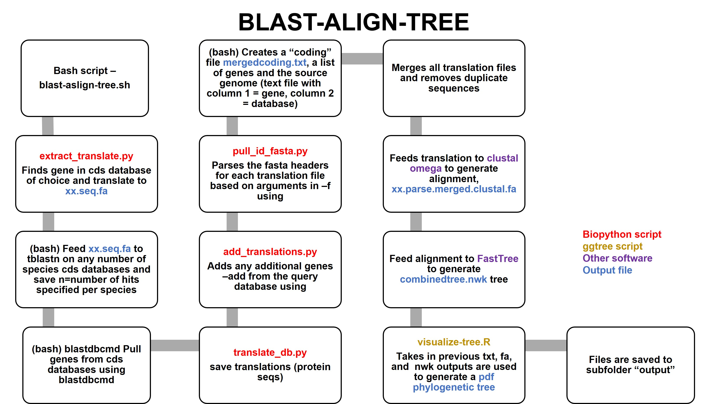
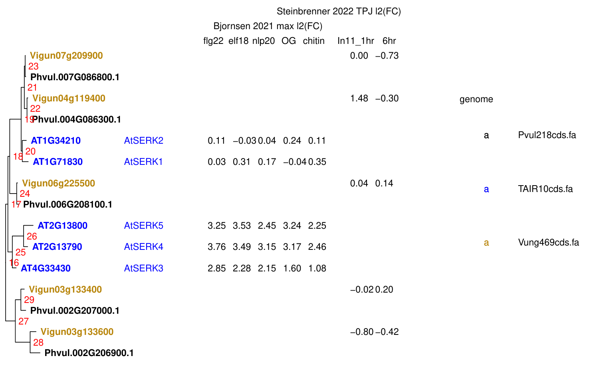
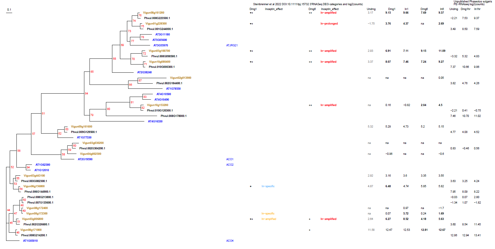
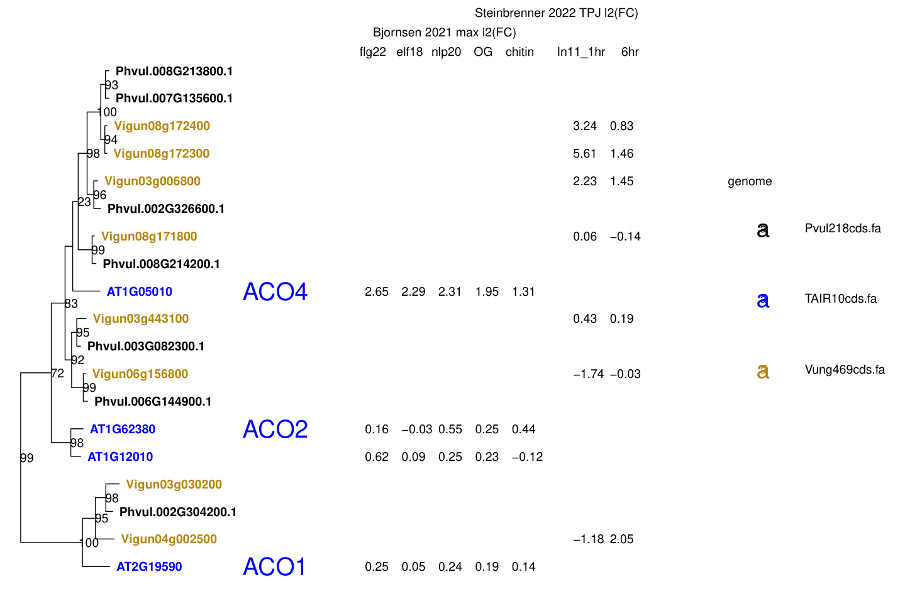

# blast-align-tree
A pipeline to identify homologs and perform phylogenetic analysis with local BLAST databases
 
## Introduction
One common comparative analysis is to find similar genes across a set of genomes and compare them using phylogenetic methods. As an alternative to using online tools for such analyses, researchers may wish to download genomes of interest for local BLAST and downstream analyses. Homolog curation, tree construction, header parsing, and visualization alongside other datasets (e.g. gene expression) can give quick insights into a gene family of interest.



## Installation
The following should be in your path

clustalo (ClustalOmega)

FastTree http://www.microbesonline.org/fasttree/

prank http://wasabiapp.org/software/prank/

trimAl http://trimal.cgenomics.org/trimal

Clone the repository which includes three genomes, Arabidopsis (TAIR10), cowpea (Phytozome), and common bean (Phytozome)

## Example output
An example output can be found in the subfolder AT4G33430.1, including a tree PDF in the subfolder "output":
https://github.com/steinbrennerlab/blast-align-tree/blob/main/AT4G33430.1/output/SERK_tree.pdf


## Run blast-align-tree for ACC Oxidase
The code below calls the blast-align-tree.sh bash script to find 15 homologs of Arabidopsis ACC Oxidase 1 from the Arabidopsis, bean, and cowpea genomes. Specify the query sequence using the locus ID AT2G19590.1 from TAIR10cds.fa. Specify the databases to query using the option "-dbs". The -hdr option will parse fasta descriptions for a specific regular expression -- for example it will look for "polypeptide=" in the common bean fasta descriptions (Pvul218cds.fa)
```
bash blast-align-tree.sh AT2G19590.1 TAIR10cds.fa -n 15 15 15 -dbs TAIR10cds.fa Pvul218cds.fa Vung469cds.fa -hdr gene: polypeptide= locus= 
```
This script will create a folder "AT2G19590.1" and populate a subfolder "output" with blast outputs, alignments, and tree visualizations in pdf format



## Redraw the ACC Oxidase tree
You can generate new versions of the pdf tree by running visualize-tree.R separately. Use option "-h" to see all visualization options. 

For example, the default tree shows ACOs as outgroups. You can reroot using option -a. 

The code below will generate a new tree rerooted on the outgroup oxigenase JRG21 (AT2G38240). Option -b specifies a new filename "ACO_v2"
```
Rscript visualize-tree.R -e AT2G19590.1 -b ACO_v2 -a AT2G38240
```

The code below will create a third tree showing just the ACO clade. Option -n specifies the node number (-n 58) and the script will use tree_subset to draw a subtree. The three other options will show bootstraps (-k 1), omit node number labels (-l 0), and enlarge the gene symbol text (-m 2)
```
Rscript visualize-tree.R -e AT2G19590.1 -b ACO_v3 -a AT2G38240 -n 58 -k 1 -l 0 -m 2 
```



## Use BLASTP instead of TBLASTN
You can run the pipeline against protein databases with a modified version of the script. The code below will pull 10 BIK1 homologs from Arabidopsis thaliana and Nicotiana benthamiana
```
bash blastp-align-tree.sh AT2G39660.1 TAIR10cds.fa -n 11 11 -dbs TAIR10protein.fa Niben261_genome.annotation.proteins.fasta -hdr gene: id
```

## Adding genomes
You can add additional genomes (coding sequences in fasta format) to the genomes subdirectory. The code below will compile a local BLAST database

```makeblastdb -in GenomeCDS.fa -parse_seqids -dbtype nucl```

Take note of appropriate header to specify when calling the bash script

