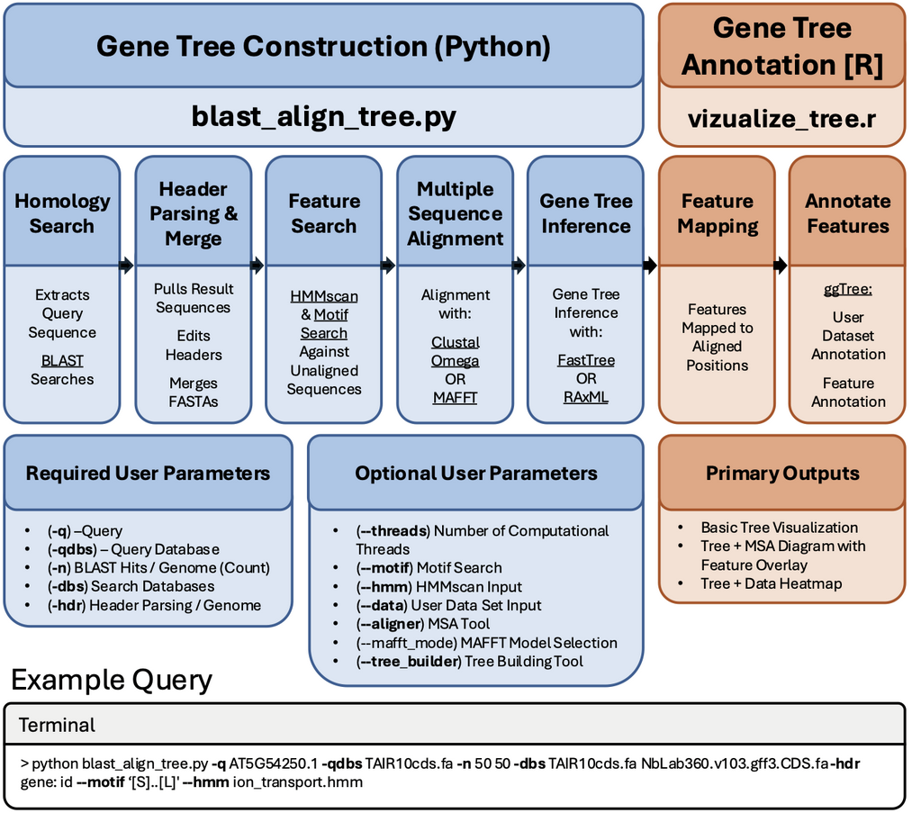
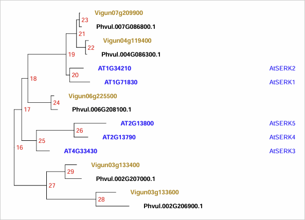
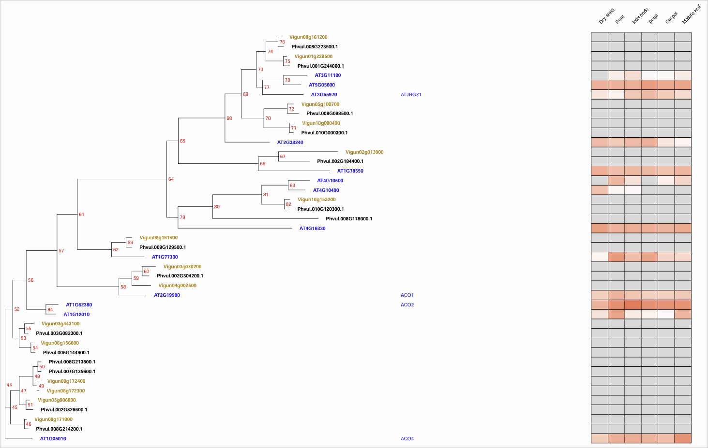
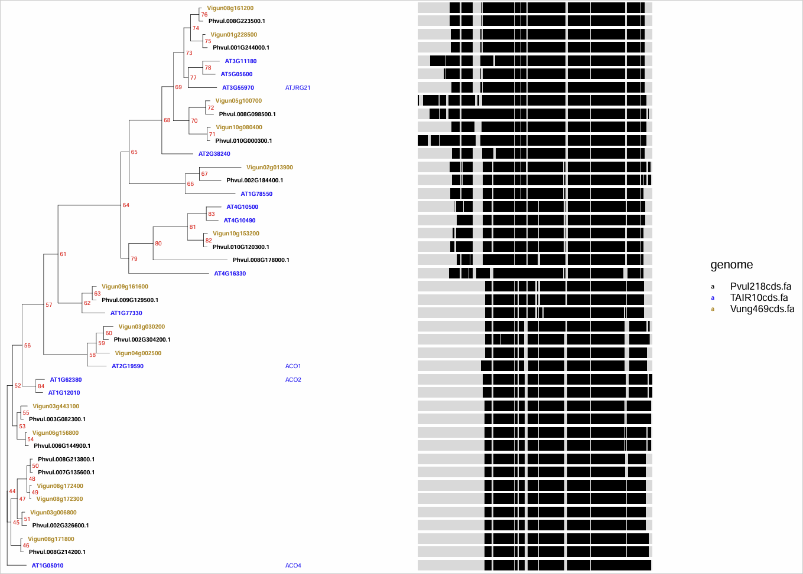
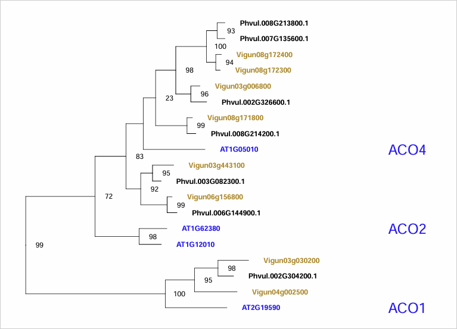
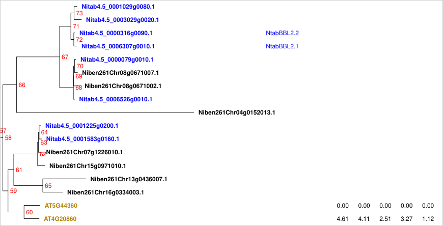
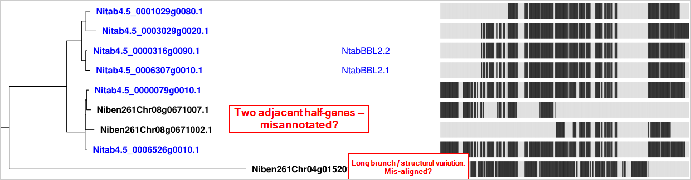

# blast-align-tree
A pipeline to identify BLAST hits and perform phylogenetic analysis across multiple queries and local genome databases.

<span style="color:red"> *September 2025 -- We are working on a major update to add new features and simplify the pipelines into a single python script. The tutorial below will not work with the current repository. Please use the v0.1.1 release with the examples below.*</span>

[](https://zenodo.org/doi/10.5281/zenodo.10888646)
 
## Introduction
A common task in bioinformatics is to find similar genes across a set of genomes and compare them using phylogenetic methods. As an alternative to using online tools for such analyses, researchers may wish to download genomes of interest for local BLAST and downstream analyses. Homolog curation, tree construction, header parsing, and visualization alongside other datasets (e.g. gene expression) can give quick insights into a gene family of interest.



## Installation
The following should be in your path

clustalo (ClustalOmega)

FastTree http://www.microbesonline.org/fasttree/

prank http://wasabiapp.org/software/prank/

trimAl https://vicfero.github.io/trimal/

test if they are installed:
```
clustalo -h;
FastTree -h;
prank -h;
trimAl -h;
```


## Example output
The repository includes three starting genomes, the complete set of coding sequences from Arabidopsis (TAIR10), [cowpea v1.1](https://data.jgi.doe.gov/refine-download/phytozome?organism=Vunguiculata&expanded=540%2CPhytozome-469) (Phytozome), and [common bean v1.0](https://data.jgi.doe.gov/refine-download/phytozome?organism=Pvulgaris&expanded=442%2CPhytozome-218) (Phytozome).

The example below is the result of running the following bash and R scripts to generate fasta, newick files, and creating a subtree PDF
```
bash tblastn-align-tree.sh -q AT4G33430.1 -qdbs TAIR10cds.fa -n 15 15 15 -dbs TAIR10cds.fa Pvul218cds.fa Vung469cds.fa -hdr gene: polypeptide= locus=
Rscript visualize-tree.R -e AT4G33430.1 -b SERK_tree -a AT5G10290 -n 45
```

The script ```tblastn-align-tree.sh``` creates a folder based on the first query sequence. An example output can be found in the subfolder ```/AT4G33430.1/```. It contains the outputs of blast searches against the three example genomes and biopython scripts to extract these sequences from the genome databases, parse fasta headers, and combine into a single fasta file ```AT4G33430.1.merged.fa```. The script then calls FastTree to generate ```AT4G33430.1.parse.merged.clustal.fa.nwk```

The subfolder ```/AT4G33430.1/output``` contains the output from a second script, ```visualize-tree.r```, which is called by default from the main bash script. It contains the following:
1. Three PDFs. The main pdf ```AT4G33430.1_TAIR10cds.fa_15_Pvul218cds.fa_15_Vung469cds.fa_15.pdf``` contains a ggtree representation of the newick tree, with associated data
2. ```AT4G33430.1_TAIR10cds.fa_15_Pvul218cds.fa_15_Vung469cds.fa_15.csv``` a list of parsed fasta headers from the search in the same order as the tree
3. Various fasta files such as ```AT4G33430.1_TAIR10cds.fa_15_Pvul218cds.fa_15_Vung469cds.fa_15.csv.aa.fa``` with the sequences provided in the same order as the tree

A second set of files in ```/AT4G33430.1/output``` contains the output from re-running ```visualize-tree.r``` a second time but with new options ```-e AT4G33430.1 -b SERK_tree -a AT5G10290 -n 45``` as specified above. The final tree PDF is below:



## Tutorial

### Run blast-align-tree for ACC Oxidase

The pipeline relies on a bash implementation of argparse, which parses the argument values listed after each option. For example, argparse will parse the three argument values after option -dbs into a variable array ("TAIR10cds.fa Pvul218cds.fa Vung469cds.fa"), thus specifying which BLAST genome databases to search in later parts of the script

The code below calls the tblastn-align-tree.sh bash script to find 15 homologs of Arabidopsis ACC Oxidase 1 from the Arabidopsis, bean, and cowpea genomes using tblastn against the complete set of coding sequences in each database. Specify the query sequence using the locus ID AT2G19590.1 from TAIR10cds.fa. Specify the databases to query using the option "-dbs". The -hdr option will parse the fasta descriptions of each database for the provided regular expression. For example it will look for "polypeptide=" in the common bean fasta descriptions (Pvul218cds.fa)
```
bash tblastn-align-tree.sh -q AT2G19590.1 -qdbs TAIR10cds.fa -n 15 15 15 -dbs TAIR10cds.fa Pvul218cds.fa Vung469cds.fa -hdr gene: polypeptide= locus= 
```
This script will create a folder "AT2G19590.1" and populate a subfolder "output" with blast outputs, alignments, and tree visualizations in pdf format. 

A powerful feature of ggtree is the ability to plot associated data. The default PDF will include log2(fold-change) data from two RNAseq datasets from [Bjornsen et al. 2021](https://www.nature.com/articles/s41477-021-00874-5) (Arabidopsis) and [Steinbrenner et al. 2021](https://onlinelibrary.wiley.com/doi/10.1111/tpj.15732?af=R) (cowpea). 



An alternative PDF with ".msa" appended will show a cartoon alignment. This is useful to show large differences in domain architecture between hits. You can explore the alignments in more detail by opening the .fasta files in the "output" folder



### Redraw the ACC Oxidase tree
You can generate new versions of the pdf tree by running visualize-tree.R separately. Use option "-h" to see all visualization options. 

For example, the default tree shows ACOs as outgroups. You can reroot using option -a. 

The code below will generate a new tree rerooted on the outgroup oxigenase JRG21 (AT2G38240). Option -b specifies a new filename "ACO_v2"
```
Rscript visualize-tree.R -e AT2G19590.1 -b ACO_v2 -a AT2G38240
```

The code below will create a third tree showing just the ACO clade by using option -n to specify the node number (-n 58). The script will use the function tree_subset to draw a subtree. The three other options specify to show bootstraps (-k 1), to omit node number labels (-l 0), and to enlarge the gene symbol text (-m 2)
```
Rscript visualize-tree.R -e AT2G19590.1 -b ACO_v3 -a AT2G38240 -n 58 -k 1 -l 0 -m 2 
```



The -n option is especially helpful to generate fasta files of a tree subset. Sequences are listed in the fasta file in the same order as the tree. visualize-tree.R uses TrimAl to remove blank-only columns from the fasta file. This can give a quick view of important differences between sequences, for example the active site of ACOs is shown below using AliView

### Organize the query subfolder before re-running the search
You will likely want to change the original search conditions for the same query sequence. Since the blast output files populate a main folder named after the query, you need to clear out this folder before re-running the script. The scripts automatically create a subfolder with the query conditions, so you can drag all contents to this subfolder, or use the bash command below.
```
find "AT2G19590.1/" -mindepth 1 -maxdepth 1 ! -name "AT2G19590.1_TAIR10cds.fa_15_Pvul218cds.fa_15_Vung469cds.fa_15" -exec mv {} "AT2G19590.1/AT2G19590.1_TAIR10cds.fa_15_Pvul218cds.fa_15_Vung469cds.fa_15" \;
```
(Note that as of this version, the visualize-tree R script relies on the files in the query folder, not the option-specific subfolder, so you can't re-visualize the tree for an old set of query options once you move these files into the subfolder.)

Now you can rerun the original script and change the argument values. For example, the code below will instead find 50 homologs from Arabidopsis only, rather than 15 hits from each of 3 genomes.
```
bash tblastn-align-tree.sh -q AT2G19590.1 -qdbs TAIR10cds.fa -n 50 -dbs TAIR10cds.fa -hdr gene:
```

### Use BLASTP or PSI-BLAST instead of TBLASTN
You can run the pipeline against protein databases with a modified version of the script. The code below will pull 10 NIMIN-1 homologs from Arabidopsis thaliana and Nicotiana benthamiana proteomes
```
bash blastp-align-tree.sh -q AT1G02450.1 -qdbs TAIR10protein.fa -n 10 10 -dbs TAIR10protein.fa Niben261_genome.annotation.proteins.fasta -hdr gene: id
```

psi-blast version:
```
bash psiblast-align-tree.sh -q AT1G02450.1 -qdbs TAIR10cds.fa -n 10 10 -dbs TAIR10protein.fa Niben261_genome.annotation.proteins.fasta -hdr gene: id
```

### Multiple queries
You can add multiple query sequences (-q) to blast each database (-dbs). The bash script will extract the query sequences from the databases specified in -qdbs (by translating the sequences for ```tblastn-align-tree.sh``` or simply extracting the amino acid sequence for ```blastp-align-tree.sh``` or ```psiblast-align-tree.sh```. The main bash script will remove duplicate sequences before alignment with an AWK command.

As an example, the code below will extract BLAST hits for two queries: AT5G45250.1 (from TAIR10cds.fa) and Phvul.007G077500.1 (from Pvul218cds.fa). 
```
bash tblastn-align-tree.sh -q AT5G45250.1 Phvul.007G077500.1 AT5G17890.1 -qdbs TAIR10cds.fa Pvul218cds.fa TAIR10cds.fa -n 3 4 -dbs TAIR10cds.fa Vung469cds.fa -hdr gene: locus=
```


### Adding a new genome to explore nicotine biosynthesis
You can add additional genomes to the genomes subdirectory. You must add compile a local BLAST database for each added genome with the code below.

For CDS files:
```
makeblastdb -in GenomeCDS.fa -parse_seqids -dbtype nucl
```

For protein files:
```
makeblastdb -in GenomeProteins.fa -parse_seqids -dbtype prot
```

For example, we can add the Nicotiana tabacum to explore the evolution of nicotine biosynthesis. First, download a new annotated proteome to the /genomes subfolder:
[N.tabacum 1.0 from Sol Genomics] (https://solgenomics.net/ftp/ftp/genomes/Nicotiana_tabacum/edwards_et_al_2017/annotation/)
Nitab-v4.5_proteins_Edwards2017.fasta

Build the local genome database in the /genomes subfolder:
```
cd genomes
makeblastdb -in Nitab-v4.5_proteins_Edwards2017.fasta -parse_seqids -dbtype prot
cd ..
```

You can now search the database you just created by listing it as an argument value after the -dbs option. For each genome you need to find an appropriate header, which you will list using option -hdr when calling the bash script. If you view Nitab-v4.5_proteins_Edwards2017.fasta you will see that the sequences are in fasta format with a simple gene id followed by description. The header we will specify is "id" which will simply parse the first word of each fasta description.

If the genome database is built you can now use it in BAT options -qdbs and -dbs alongside old genomes. For example, the code below will search for berberine bridge enzymes responsible for nicotine biosynthesis. [Xu et al](https://www.pnas.org/doi/full/10.1073/pnas.1700073114) described that the BBL gene family is expanded in tobacco relative to tomato, but what about relative to other Nicotiana species? By using BBL2.1 as a query we can also identify hits in N.benthamiana
```
bash psiblast-align-tree.sh \
-q Nitab4.5_0006307g0010.1 \
-qdbs Nitab-v4.5_proteins_Edwards2017.fasta \
-n 20 20 20 \
-dbs \
TAIR10protein.fa \
Nitab-v4.5_proteins_Edwards2017.fasta \
Niben261_genome.annotation.proteins.fasta \
-hdr \
gene: \
id \
id
```

This quick tree with associated data gives two conclusions: 1) the BBL genes seem to be expanded in N.tabacum relative to N.benthamiana, and 2) an Arabidopsis BBL is PAMP-inducible

However, it is always worth viewing your alignments in more detail. Two problems stand out when we look at the multiple sequence alignment PDF:


Put simply, the pipeline allows you to be cautious with your analyses of gene family evolution. Use repeated rounds of querying to refine your trees, search different genome versions, and use different software for alignment and phylogenetic inference before making strong conclusions.


## Future features
We are currently working on
1. iterative blast using a first set of hits as secondary queries
2. better organization of query and sub-query folders
3. displaying a subsequence of the MSA in the alignment PDF
4. searching for motifs to display in the MSA

If you'd like to contribute please reach out to Ben and Adam: bdshep@uw.edu and astein10@uw.edu
