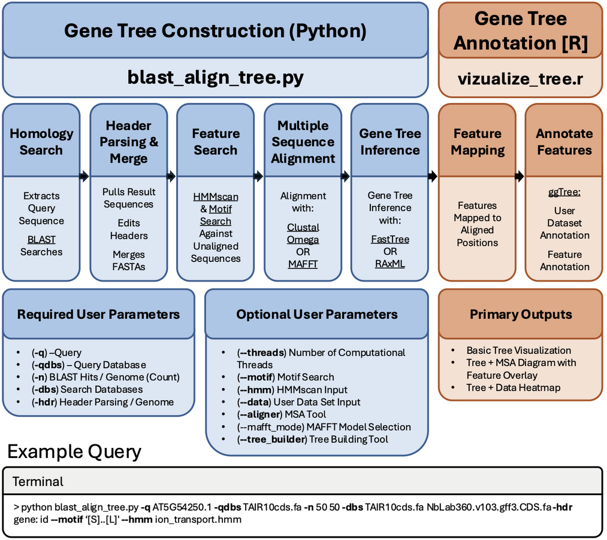
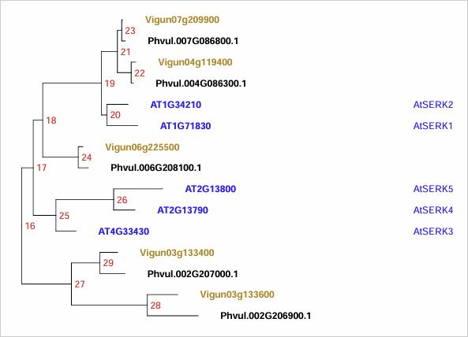
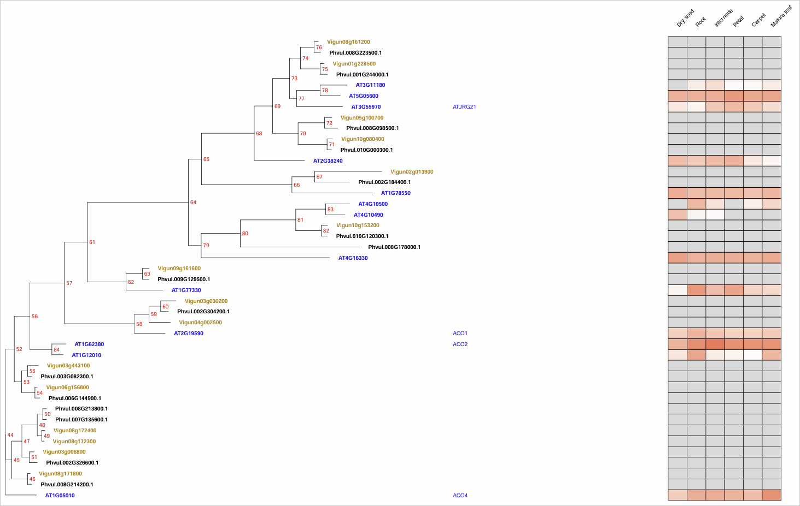
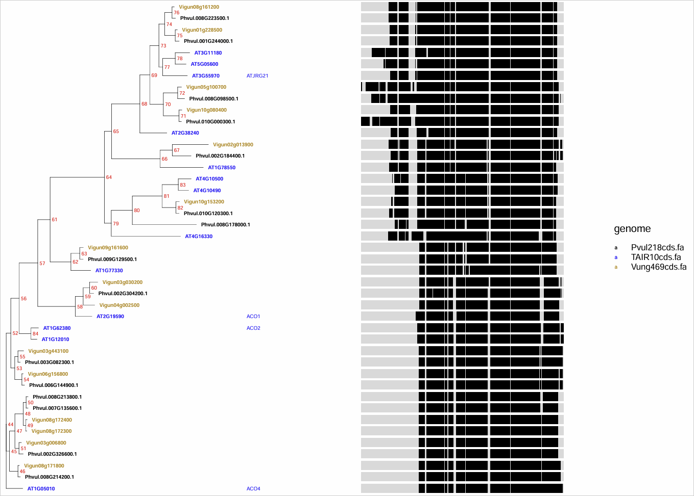
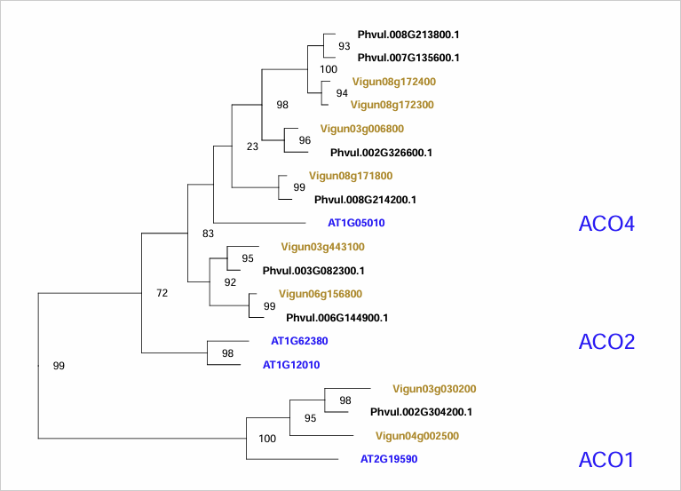
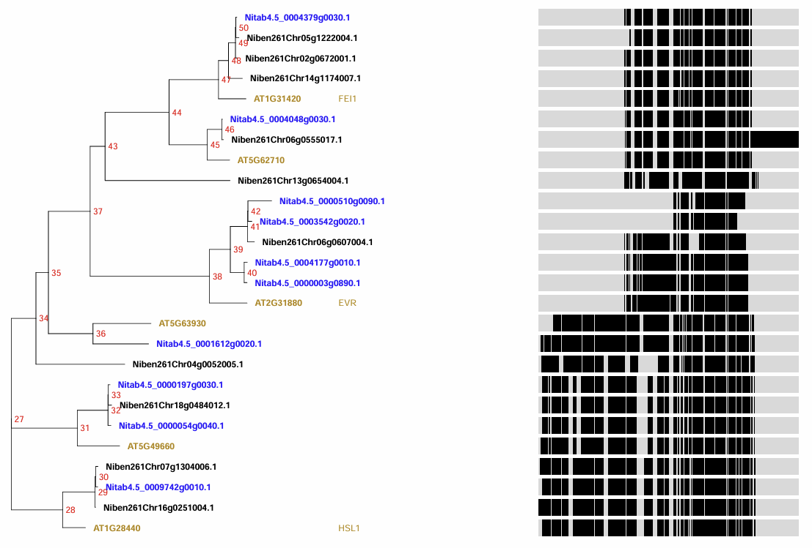

# blast-align-tree

A pipeline to identify BLAST hits and perform phylogenetic analysis across
multiple queries and local genome databases.

[](https://zenodo.org/doi/10.5281/zenodo.10888646)

## Introduction

A common task in bioinformatics is to find similar genes across a set of
genomes and compare them using phylogenetic methods. As an alternative to
using online tools for such analyses, researchers may wish to download
genomes of interest for local BLAST and downstream analyses. Homolog
curation, tree construction, header parsing, and visualization alongside
other datasets (e.g. gene expression) can give quick insights into a gene
family of interest.

<!-- TODO: regenerate images/flowchart.png if the pipeline layout has changed -->


## Installation

### Python package

```
pip install blast-align-tree
```

This installs three console commands:

| Command | Purpose |
|---|---|
| `blast-align-tree` | Run the pipeline (BLAST → align → tree → visualize) |
| `bat-genome-selector` | Tkinter GUI for building `blast-align-tree` commands |
| `blast-align-tree-fetch` | Download bundled genome FASTAs into `./genomes/` |

From a fresh clone of this repo you can do an editable install instead:

```
pip install -e .
```

### External tools (must be on PATH)

`pip` cannot install these — use conda/mamba or your system package
manager.

- **BLAST+** (`makeblastdb`, `blastdbcmd`, `tblastn`, `blastp`, `psiblast`)
- **MAFFT** (≥ 7) — default aligner
- **Clustal Omega** (`clustalo`) — alternative aligner
- **trimAl** — alignment cleanup
- **FastTree** and/or **RAxML-NG** — tree inference
- **R** with `ggtree`, `ape`, `phytools`, `ggplot2`, `optparse`, `treeio`,
  `tidytree`, `broom`
- **HMMER** (`hmmscan`, `hmmpress`) — optional, only needed for `--hmm`

Conda YAML files covering all of the above live under `environments/`.
Pick the one for your platform and create an env:

**conda (Linux):**

```
conda env create -f environments/bat-environment-linux.yml
conda activate bat
pip install blast-align-tree
```

**mamba / micromamba (Linux — faster solver):**

```
mamba env create -f environments/bat-environment-linux.yml
mamba activate bat
pip install blast-align-tree
```

**macOS (Apple Silicon or Intel):**

```
mamba env create -f environments/bat-environment-ARMorIntel-mac.yml
mamba activate bat
pip install blast-align-tree
```

**Windows:**

```
mamba env create -f environments/bat-environment-windows.yml
mamba activate bat
pip install blast-align-tree
```

Verify everything is wired up:

```
blast-align-tree --check-env
```

### HMM profiles need `hmmpress`

The repo ships `.hmm` input files under `hmm_files/` (e.g.
`hmm_files/kinase.hmm`) but **not** the `.h3*` binary indices — those are
build artifacts and are deleted from the repo. Before using `--hmm`, build
the index locally:

```
hmmpress hmm_files/kinase.hmm
```

This produces `kinase.hmm.h3f`, `.h3i`, `.h3m`, `.h3p` alongside the input.

### Fetching genome databases

Genome FASTAs are too large to bundle in the pip package. The downloader
reads a manifest and drops the selected genomes into `./genomes/`:

```
blast-align-tree-fetch               # default set 🌱 🌿 🫘
blast-align-tree-fetch --all         # everything listed in the manifest 🌍
blast-align-tree-fetch --list        # show available genomes + sizes
```

The default set 🌱🌿🫘🍅 is:

- 🌱 **TAIR10 CDS** — *Arabidopsis thaliana* coding sequences
- 🌿 **TAIR10 proteins** — *Arabidopsis thaliana* proteome
- 🫘 **Pvul218 CDS** — *Phaseolus vulgaris* (common bean) coding sequences
- 🍅 **Niben261 proteins** — *Nicotiana benthamiana* proteome (v2.6.1)

`--all` 🌍 additionally pulls the rest of the hosted lineup:

- Other plants: 🫛 cowpea CDS
- Animals / fungus (fetched into `./genomes/animals/`):
  🧑 human CDS, 🐭 mouse CDS, 🐀 rat CDS, 🐒 chimp CDS,
  🐟 zebrafish CDS, 🪰 fruit fly CDS, 🪱 *C. elegans* CDS,
  🍞 yeast ORFs (*S. cerevisiae* S288C)

Run `blast-align-tree-fetch --list` for the full lineup and sizes.

All pipeline runs should happen in the directory that contains
`./genomes/`.

## GUI: `bat-genome-selector`

The easiest way to build a valid `blast-align-tree` invocation is the
Tkinter GUI. Launch it from a directory that contains a `genomes/` folder:

```
bat-genome-selector
```

<!-- TODO: add screenshot images/gui.png once the GUI is regenerated -->

### Key features

- **Auto-discovery.** Scans `./genomes/` (recursively) for `.fa`, `.faa`,
  `.fas`, `.fasta`, `.fna` files and ignores BLAST index sidecars.
- **Header auto-detection.** Peeks at the first FASTA record in each
  database and suggests a plausible `-hdr` token (e.g. `gene:`, `locus=`,
  `polypeptide=`), with a live "Parsed name" preview so you can see
  exactly what will appear on the tree.
- **Per-row controls.** One row per genome: include checkbox, query
  column, `-hdr`, `-hdr_sfx`, `-n` (hits to keep), nucleotide/protein
  type, and a "build DB" shortcut that runs `makeblastdb` when the BLAST
  indices are missing.
- **Bulk actions.** *Select All Hits*, *Deselect All Hits*, *Clear
  Fields*, *Refresh*, plus a **Default -n** spinbox and **Set All -n**
  button.
- **Options panel.** Aligner (Clustal Omega or MAFFT + mode), tree builder
  (FastTree or RAxML), BLAST type (tblastn/blastp), thread count.
- **Advanced panel** (collapsible): outgroups (`-add`, `-add_db`), AA
  slice (`-aa`), motif patterns (regex or PROSITE, overlap toggle), and
  HMM profiles (`--hmm`).
- **Generate Command / Copy to Clipboard.** Produces a ready-to-paste
  `blast-align-tree …` command.
- **Recent Runs tab.** Lists past `ENTRY/runs/TIMESTAMP/` directories in
  the current working directory so you can quickly jump back to prior
  results.

## Example output

The default genome set includes Arabidopsis TAIR10 CDS. The example below
runs the pipeline for a SERK query and redraws the resulting tree with a
new subnode/outgroup:

```
blast-align-tree -q AT4G33430.1 -qdbs TAIR10cds.fa \
                 -n 15 15 15 \
                 -dbs TAIR10cds.fa Pvul218cds.fa Vung469cds.fa \
                 -hdr gene: polypeptide= locus=
```

The pipeline creates a folder `AT4G33430.1/` in your working directory.
The timestamped run root keeps the tree PDFs. Newick tree files, gene
lists, alignment FASTAs, mappings, features, BLAST hit FASTAs, and
per-genome summaries go under
`AT4G33430.1/runs/<TIMESTAMP>/genes_alignments_trees/`.

After the run finishes, the pipeline prints a re-draw hint. For example,
to reroot on an outgroup (`-a AT5G10290`) and zoom in on a subnode
(`-n 45`):

```
Rscript "<bundled-visualize_tree.r>" -e AT4G33430.1 -b SERK_tree \
        --subdir "runs/<TIMESTAMP>" -a AT5G10290 -n 45
```

The bundled path is printed for you at the end of each pipeline run,
already wrapped in double quotes — keep the quotes when copy-pasting,
especially on Windows, where unquoted paths can cause `Rscript` to
segfault if they contain spaces or backslashes that the shell misparses.

<!-- TODO: regenerate images/tree.png from the SERK run above -->


## Tutorial

### Run blast-align-tree for ACC Oxidase

Find 15 homologs of Arabidopsis ACC Oxidase 1 from three plant genomes
using `tblastn` against complete CDS databases. `-q` specifies the query
locus, `-qdbs` the database it lives in, `-dbs` the databases to search,
and `-hdr` the regex tokens used to parse gene names out of each
database's FASTA headers.

```
blast-align-tree -q AT2G19590.1 -qdbs TAIR10cds.fa \
                 -n 15 15 15 \
                 -dbs TAIR10cds.fa Pvul218cds.fa Vung469cds.fa \
                 -hdr gene: polypeptide= locus=
```

This creates `AT2G19590.1/` with tree PDFs at the timestamped run root and
Newick tree files, alignment files, BLAST hit FASTAs, and per-genome
summaries under `genes_alignments_trees/`.

A powerful feature of `ggtree` is the ability to plot associated data.
Each run produces two complementary tree PDFs:

1. **Text version** — gene symbols and dataset values printed as labels
   next to each tip.
2. **Heatmap version** — the same tree with associated data rendered as
   a coloured heatmap alongside the tips.

By default, both include expression data from the [Klepikova *Arabidopsis*
expression atlas](https://pubmed.ncbi.nlm.nih.gov/26923014/) (headers are
matched to the AtGenExpress / eFP browser tissue naming). The screenshot
below shows the heatmap version:

<!-- TODO: regenerate images/ACO-tree-1.png (heatmap version) from the ACO run above -->


A separate PDF with `.MSA.pdf` appended shows a cartoon alignment — useful
for spotting large differences in domain architecture. Open the
underlying FASTA files in `genes_alignments_trees/` to inspect the
alignment in detail.

<!-- TODO: regenerate images/ACO-tree-2.png (.MSA.pdf cartoon alignment) -->


### Redraw the ACC Oxidase tree

You can re-run `visualize_tree.r` at any time to produce new PDFs. The
pipeline prints a ready-to-edit `Rscript …` command at the end of each
run; copy it and tweak options such as:

- `-b <NAME>` — filename stem for the new PDFs
- `-a <ID>` — reroot on this outgroup
- `-n <NODE>` — draw a subtree at this node (use `--help` for the full
  option list)
- `-k 1` — show bootstraps
- `-l 0` — hide node number labels
- `-m 2` — enlarge gene-symbol text

For example, reroot the default ACO tree on JRG21 (AT2G38240) and zoom
into the ACO clade at node 58:

```
Rscript "<bundled-visualize_tree.r>" -e AT2G19590.1 -b ACO_v3 \
        --subdir "runs/<TIMESTAMP>" -a AT2G38240 -n 58 -k 1 -l 0 -m 2
```

<!-- TODO: regenerate images/ACO-tree-3.png -->


The `-n` option is especially helpful for extracting a subset of the tree
as a FASTA. Sequences are listed in the FASTA in the same order as the
tree, and `trimAl` is used to strip blank-only alignment columns — useful
for a quick view of conserved residues (e.g. the ACO active site) in a
viewer like AliView.

### BLASTP instead of TBLASTN

Use `--blast_type blastp` against protein databases. The example below
pulls 10 NIMIN-1 homologs from the Arabidopsis and *Nicotiana
benthamiana* proteomes:

```
blast-align-tree --blast_type blastp \
                 -q AT1G02450.1 -qdbs TAIR10protein.fa \
                 -n 10 10 \
                 -dbs TAIR10protein.fa Niben261_genome.annotation.proteins.fasta \
                 -hdr gene: id
```

### Multiple queries

You can pass several query sequences with `-q`; the pipeline extracts
each from the database listed at the matching position in `-qdbs`,
de-duplicates, then searches each `-dbs` entry. The example below uses
three queries drawn from two databases and searches two other databases:

```
blast-align-tree -q AT5G45250.1 Phvul.007G077500.1 AT5G17890.1 \
                 -qdbs TAIR10cds.fa Pvul218cds.fa TAIR10cds.fa \
                 -n 3 4 \
                 -dbs TAIR10cds.fa Vung469cds.fa \
                 -hdr gene: locus=
```

### Adding a new genome

You can drop additional genomes into `./genomes/` and use them alongside
the bundled ones. For each new genome you need a local BLAST database.

For CDS files:

```
makeblastdb -in GenomeCDS.fa -parse_seqids -dbtype nucl
```

For protein files:

```
makeblastdb -in GenomeProteins.fa -parse_seqids -dbtype prot
```

#### Example: add *Nicotiana tabacum* and rebuild an earlier tree

Download an annotated tobacco proteome into `./genomes/`:

- [*N. tabacum* v4.5 from Sol Genomics](https://solgenomics.net/ftp/ftp/genomes/Nicotiana_tabacum/edwards_et_al_2017/annotation/)
  → `Nitab-v4.5_proteins_Edwards2017.fasta`

Build the BLAST database:

```
cd genomes
makeblastdb -in Nitab-v4.5_proteins_Edwards2017.fasta -parse_seqids -dbtype prot
cd ..
```

Inspecting the first record of `Nitab-v4.5_proteins_Edwards2017.fasta`
shows that headers use a gene id followed by a description — `-hdr id`
keeps just the first token.

Now build a SOBIR1 homolog tree across Arabidopsis, *N. benthamiana*,
and the freshly added tobacco proteome:

```
blast-align-tree --blast_type blastp \
                 -q AT2G31880.1 -qdbs TAIR10protein.fa \
                 -n 10 10 10 \
                 -dbs TAIR10protein.fa \
                       Niben261_genome.annotation.proteins.fasta \
                       Nitab-v4.5_proteins_Edwards2017.fasta \
                 -hdr gene: id id
```

The run produces a tree PDF with tobacco SOBIR1 homologs slotted in
alongside the *N. benthamiana* and Arabidopsis sequences.

<!-- TODO: regenerate images/SOBIR1_with_ntab.png from the run above -->


### Rebuild the SOBIR1 tree with MAFFT and RAxML

By default the pipeline aligns with Clustal Omega and infers the tree
with FastTree, but both are swappable. The command below rebuilds the
same SOBIR1 tree (Arabidopsis + *N. benthamiana* + tobacco) using
**MAFFT** in `linsi` mode and **RAxML-NG** for the tree inference:

```
blast-align-tree --blast_type blastp \
                 --aligner mafft --mafft_mode linsi \
                 --tree_builder RAxML \
                 -q AT2G31880.1 -qdbs TAIR10protein.fa \
                 -n 10 10 10 \
                 -dbs TAIR10protein.fa \
                       Niben261_genome.annotation.proteins.fasta \
                       Nitab-v4.5_proteins_Edwards2017.fasta \
                 -hdr gene: id id
```

RAxML-NG is noticeably slower than FastTree but provides maximum-
likelihood branch support via bootstrapping. Comparing the two trees is
a quick sanity check that any clades you care about are stable across
inference methods.

Use repeated rounds of querying to refine your trees, search different
genome versions, and compare aligners / tree builders before drawing
strong conclusions.

## Future features

We are currently working on:

1. Iterative BLAST using a first set of hits as secondary queries
2. Better organization of query and sub-query folders
3. Displaying a subsequence of the MSA in the alignment PDF
4. Richer motif / HMM visualization overlaid on the MSA

If you'd like to contribute, reach out to Ben and Adam:
`bdshep@uw.edu` and `astein10@uw.edu`.
