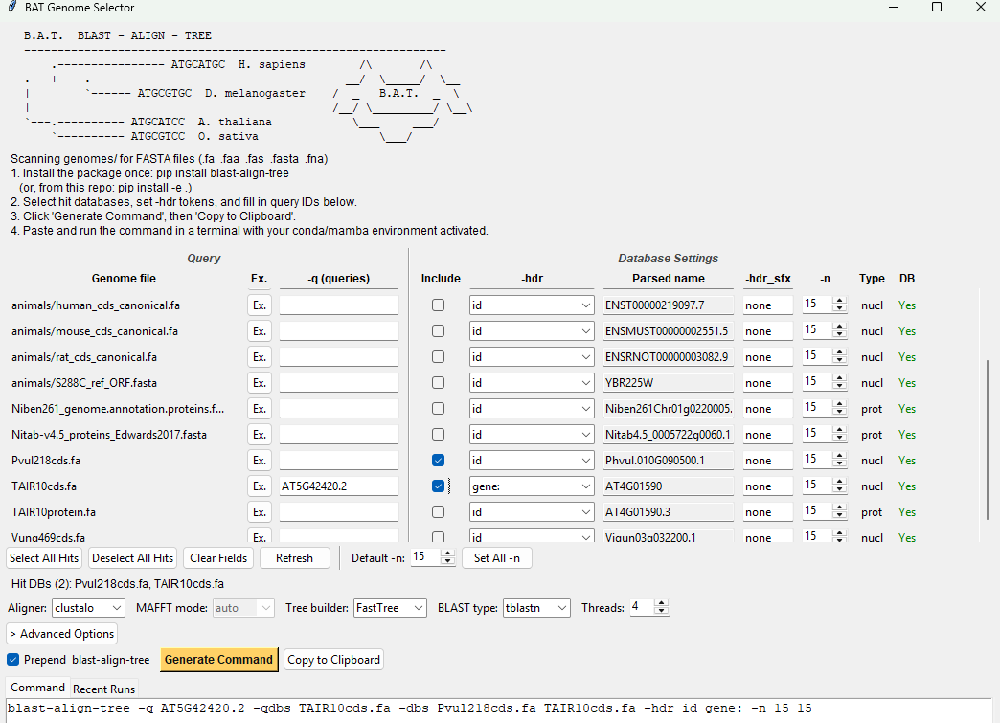

# blast-align-tree

A pipeline to identify BLAST hits and perform phylogenetic analysis across
multiple queries and local genome databases.

[](https://zenodo.org/doi/10.5281/zenodo.10888646)

## 📖 Introduction

A common task in bioinformatics is to find similar genes across a set of
genomes and compare them using phylogenetic methods. As an alternative to
using online tools for such analyses, researchers may wish to download
genomes of interest for local BLAST and downstream analyses. Homolog
curation, tree construction, header parsing, and visualization alongside
other datasets (e.g. gene expression) can give quick insights into a gene
family of interest.

<!-- TODO: regenerate images/flowchart.png if the pipeline layout has changed -->


## ⚙️ Installation

### Step 1. Clone the repo

The recommended install path starts with a clone — it gives you the
conda environment YAMLs, helper scripts, and `hmm_files/` locally so
the commands below run as-is.

```
git clone https://github.com/steinbrennerlab/blast-align-tree.git
cd blast-align-tree
```

### Step 2. Create the conda environment (non-Python tools)

`blast-align-tree` calls several external CLIs that `pip` can't install:

- **BLAST+** (`makeblastdb`, `blastdbcmd`, `tblastn`, `blastp`, `psiblast`)
- **MAFFT** (≥ 7) — default aligner
- **Clustal Omega** (`clustalo`) — alternative aligner
- **trimAl** — alignment cleanup
- **FastTree** and/or **RAxML-NG** — tree inference
- **R** with `ggtree`, `ape`, `phytools`, `ggplot2`, `optparse`, `treeio`,
  `tidytree`, `broom`
- **HMMER** (`hmmscan`, `hmmpress`) — optional, only needed for `--hmm`

Environment YAML files for each platform live under `environments/`.
Create and activate the env with conda, mamba, or micromamba (mamba /
micromamba are noticeably faster):

**Linux:**

```
mamba env create -f environments/bat-environment-linux.yml
mamba activate bat
```

**macOS (Apple Silicon or Intel):**

```
mamba env create -f environments/bat-environment-ARMorIntel-mac.yml
mamba activate bat
```

**Windows:**

```
mamba env create -f environments/bat-environment-windows.yml
mamba activate bat
```

#### Platform-specific gaps

Only the Linux YAML is a complete one-shot install. The macOS and
Windows YAMLs each cover a different half of the stack; fill in the
missing pieces after creating the env.

**macOS — R / plotting stack is not in the YAML.** The mac YAML ships
the CLI tools (BLAST+, MAFFT, Clustal Omega, trimAl, FastTree,
RAxML-NG, HMMER) plus Python, but not R or any of the tree-plotting
packages — bioconda's R / Bioconductor coverage is patchy on Apple
Silicon (`osx-arm64`), so R is installed via CRAN instead. Install R
separately (e.g. `brew install r` or from
[CRAN](https://cran.r-project.org/)) and then run the bundled installer
to pull `ggtree`, `ggplot2`, `ape`, `phytools`, `tidytree`, `treeio`,
`optparse`, `broom`, and `Biostrings`:

```
Rscript environments/install_r_deps.R
```

**Windows — external CLI tools are not in the YAML.** Bioconda doesn't
build BLAST+, MAFFT, Clustal Omega, trimAl, FastTree, RAxML-NG, or
HMMER for Windows, so the Windows YAML only provisions the R stack
plus Python. Install the CLI tools from their vendors (add each to
`PATH` after install):

- [NCBI BLAST+](https://ftp.ncbi.nlm.nih.gov/blast/executables/blast+/LATEST/) (`ncbi-blast-*+-x64-win64.exe`)
- [MAFFT](https://mafft.cbrc.jp/alignment/software/windows_without_cygwin.html) (all-in-one Windows build)
- [RAxML-NG](https://github.com/amkozlov/raxml-ng/releases) (Windows zip)
- [Clustal Omega](http://www.clustal.org/omega/) (Windows binary)
- [FastTree](http://www.microbesonline.org/fasttree/#Install) (`FastTree.exe`)
- [trimAl](https://github.com/inab/trimal/releases) (Windows build) — or compile from source
- [HMMER](http://hmmer.org/download.html) — Windows users typically run it under WSL

If you'd rather avoid hand-installing these, run the Linux YAML under
**WSL2** (Ubuntu) and drive the pipeline from there — everything is in
bioconda on that path.

### 3. Install the Python package

From inside the activated env from Step 2:

```
pip install blast-align-tree
```

This installs three console commands:

| Command | Purpose |
|---|---|
| `blast-align-tree` | Run the pipeline (BLAST → align → tree → visualize) |
| `bat-genome-selector` | Tkinter GUI for building `blast-align-tree` commands |
| `blast-align-tree-fetch` | Download bundled genome FASTAs into `./genomes/` |

If you're developing against the repo, use an editable install instead:

```
pip install -e .
```

Verify everything is wired up:

```
blast-align-tree --check-env
```

#### Skipping the clone

If you don't want to clone the repo, you can grab just the environment
YAML for your platform directly from GitHub and run `mamba env create
-f <file>` against it:

- Linux: [`bat-environment-linux.yml`](https://raw.githubusercontent.com/steinbrennerlab/blast-align-tree/main/environments/bat-environment-linux.yml)
- macOS (Apple Silicon or Intel): [`bat-environment-ARMorIntel-mac.yml`](https://raw.githubusercontent.com/steinbrennerlab/blast-align-tree/main/environments/bat-environment-ARMorIntel-mac.yml)
- Windows: [`bat-environment-windows.yml`](https://raw.githubusercontent.com/steinbrennerlab/blast-align-tree/main/environments/bat-environment-windows.yml)

Then `pip install blast-align-tree` inside the env. Note that some
tutorial commands (`hmmpress hmm_files/kinase.hmm`, the
`scripts/populate_manifest.py` helper, etc.) assume a repo clone.

### 4. Build HMM profiles with `hmmpress`

The repo ships `.hmm` input files under `hmm_files/` (e.g.
`hmm_files/kinase.hmm`) but **not** the `.h3*` binary indices — those are
build artifacts and are deleted from the repo. Before using `--hmm`, build
the index locally:

```
hmmpress hmm_files/kinase.hmm
```

This produces `kinase.hmm.h3f`, `.h3i`, `.h3m`, `.h3p` alongside the input.

### Working directory

`blast-align-tree` is filesystem-driven: it reads genome FASTAs from
`./genomes/` and writes run outputs into the **current working
directory**. If you cloned the repo (the recommended install), run
everything from the repo root — `./genomes/` and `./datasets/` are
already in place.

If you installed via pip without cloning, pick any project folder
instead:

```
mkdir ~/bat-project && cd ~/bat-project
```

You can keep several projects side-by-side; each has its own
`./genomes/` and its own run outputs. Pipeline commands invoked from
any other directory won't find your genomes.

### Fetching bundled genome databases

If you cloned the repo, `./genomes/` and `./datasets/` are already
populated — **skip this section** unless you want to refresh the hosted
set or pull additional opt-in genomes with `--all`.

For pip-only installs (or to re-pull a hosted asset cleanly), fetch
into your project directory:

```
blast-align-tree-fetch               # default set 🌱 🌿 🫘 🫛 🍅 📊
blast-align-tree-fetch --all         # everything listed in the manifest 🌍
blast-align-tree-fetch --list        # show available genomes + sizes
```

Genome FASTAs are too large to ship inside the pip package, so a small
set of reference plant and animal genomes is hosted as GitHub release
assets. `blast-align-tree` ships a **manifest**
(`blast_align_tree/data/genomes_manifest.json` inside the installed
package) listing each hosted genome with its URL and sha256 checksum.
The manifest is read-only from a user's perspective — you don't edit it
directly.

Files land in `./genomes/`. Animal and fungal genomes sort into
`./genomes/animals/`. Downloads are checksum-verified against the
manifest and decompressed automatically, so re-running is safe — already
present files are skipped if their hash matches. After each successful
download `blast-align-tree-fetch` runs `makeblastdb` on the FASTA (the
nucleotide / protein mode is auto-detected), so the files are ready for
the pipeline with no extra step. Pass `--no-index` to skip that.

The default set 🌱🌿🫘🫛🍅📊 is:

- **TAIR10 CDS** — *Arabidopsis thaliana* coding sequences
- **TAIR10 proteins** — *Arabidopsis thaliana* proteome
- **Pvul218 CDS** — *Phaseolus vulgaris* (common bean) coding sequences
- **Vung469 CDS** — *Vigna unguiculata* (cowpea) coding sequences
- **Niben261 proteins** — *Nicotiana benthamiana* proteome (v2.6.1)
- 📊 **Klepikova atlas subset** — *Arabidopsis* expression overlay
  dataset (lands in `./datasets/`, not `./genomes/`)

`--all` 🌍 additionally pulls the rest of the hosted lineup
(fetched into `./genomes/animals/`): human CDS, mouse CDS,
rat CDS, chimp CDS, zebrafish CDS, fruit fly CDS,
*C. elegans* CDS, yeast ORFs (*S. cerevisiae* S288C).

Run `blast-align-tree-fetch --list` for the full lineup and sizes.

**Using your own genome files instead of (or alongside) the hosted set?**
Drop any FASTA into `./genomes/` — no manifest edit, no reinstall
needed. See [Adding a new genome](#adding-a-new-genome) below.

## 🖥️ GUI: `bat-genome-selector`

The easiest way to build a valid `blast-align-tree` invocation is the
Tkinter GUI. Launch it from a directory that contains a `genomes/` folder:

```
bat-genome-selector
```



### Key features

- **Auto-discovery.** Scans `./genomes/` (recursively) for `.fa`, `.faa`,
  `.fas`, `.fasta`, `.fna` files and ignores BLAST index sidecars.
- **Header auto-detection.** Peeks at the first FASTA record in each
  database and suggests a plausible `-hdr` token (e.g. `gene:`, `locus=`,
  `polypeptide=`), with a live "Parsed name" preview so you can see
  exactly what will appear on the tree.
- **Per-row controls.** One row per genome: include checkbox, query
  column, `-hdr`, `-hdr_sfx`, `-n` (hits to keep), nucleotide/protein
  type, and a "build DB" shortcut that runs `makeblastdb` when the BLAST
  indices are missing.
- **Bulk actions.** *Select All Hits*, *Deselect All Hits*, *Clear
  Fields*, *Refresh*, plus a **Default -n** spinbox and **Set All -n**
  button.
- **Options panel.** Aligner (Clustal Omega or MAFFT + mode), tree builder
  (FastTree or RAxML), BLAST type (tblastn/blastp), thread count.
- **Advanced panel** (collapsible): outgroups (`-add`, `-add_db`), AA
  slice (`-aa`, single range applied to all queries, or one range per
  query — see the tutorial section below), motif patterns (regex or
  PROSITE, overlap toggle), and HMM profiles (`--hmm`).
- **Generate Command / Copy to Clipboard.** Produces a ready-to-paste
  `blast-align-tree …` command.
- **Recent Runs tab.** Lists past `ENTRY/runs/TIMESTAMP/` directories in
  the current working directory so you can quickly jump back to prior
  results.

## 📚 Full Tutorial

The tutorial commands below use the default files included in the repo clone. 
If you start from a new directory, `blast-align-tree-fetch` will download the 
genomes and sample dataset, but not environment and hmm files. Make sure to set up all packages, as described in the Installation section Steps 1-4.

### Generate a simple tree

The example below runs the pipeline for a SERK query and redraws the
resulting tree with a new subnode/outgroup. It searches three genomes
from the default fetched set: 🌱 TAIR10cds, 🫘 Pvul218cds, and 🫛
Vung469cds.

```
blast-align-tree -q AT4G33430.1 -qdbs TAIR10cds.fa \
                 -n 15 15 15 \
                 -dbs TAIR10cds.fa Pvul218cds.fa Vung469cds.fa \
                 -hdr gene: polypeptide= locus=
```

The pipeline creates a folder `AT4G33430.1/` in your working directory.
The timestamped run root keeps the tree PDFs. Newick tree files, gene
lists, alignment FASTAs, mappings, features, BLAST hit FASTAs, and
per-genome summaries go under
`AT4G33430.1/runs/<TIMESTAMP>/genes_alignments_trees/`.

After the run finishes, the pipeline prints a re-draw hint. For example,
to reroot on an outgroup (`-a AT5G10290`) and zoom in on a subnode
(`-n 45`):

```
Rscript "<bundled-visualize_tree.r>" -e AT4G33430.1 -b SERK_tree \
        --subdir "runs/<TIMESTAMP>" -a AT5G10290 -n 45
```

The bundled path is printed for you at the end of each pipeline run,
already wrapped in double quotes — keep the quotes when copy-pasting,
especially on Windows, where unquoted paths can cause `Rscript` to
segfault if they contain spaces or backslashes that the shell misparses.


### Run blast-align-tree for a different gene, ACC Oxidase

Find 15 homologs of Arabidopsis ACC Oxidase 1 from three plant genomes
using `tblastn` against complete CDS databases. `-q` specifies the query
locus, `-qdbs` the database it lives in, `-dbs` the databases to search,
and `-hdr` the regex tokens used to parse gene names out of each
database's FASTA headers.

```
blast-align-tree -q AT2G19590.1 -qdbs TAIR10cds.fa \
                 -n 15 15 15 \
                 -dbs TAIR10cds.fa Pvul218cds.fa Vung469cds.fa \
                 -hdr gene: polypeptide= locus=
```

This creates `AT2G19590.1/` with tree PDFs at the timestamped run root and
Newick tree files, alignment files, BLAST hit FASTAs, and per-genome
summaries under `genes_alignments_trees/`.

A powerful feature of `ggtree` is the ability to plot associated data.
Each run produces two complementary tree PDFs:

1. **Text version** — gene symbols and dataset values printed as labels
   next to each tip.
2. **Heatmap version** — the same tree with associated data rendered as
   a coloured heatmap alongside the tips.

By default, both include expression data from the [Klepikova *Arabidopsis*
expression atlas](https://pubmed.ncbi.nlm.nih.gov/26923014/) (headers are
matched to the AtGenExpress / eFP browser tissue naming). The overlay
TSV is fetched automatically into `./datasets/` by
`blast-align-tree-fetch`. The screenshot below shows the heatmap version:


A separate PDF with `.MSA.pdf` appended shows a cartoon alignment — useful
for spotting large differences in domain architecture. Open the
underlying FASTA files in `genes_alignments_trees/` to inspect the
alignment in detail.


### Redraw the ACC Oxidase tree

You can re-run `visualize_tree.r` at any time to produce new PDFs. The
pipeline prints a ready-to-edit `Rscript …` command at the end of each
run; copy it and tweak options such as:

- `-b <NAME>` — filename stem for the new PDFs
- `-a <ID>` — reroot on this outgroup
- `-n <NODE>` — draw a subtree at this node (use `--help` for the full
  option list)
- `-k 1` — show bootstraps
- `-l 0` — hide node number labels
- `-m 2` — enlarge gene-symbol text

For example, reroot the default ACO tree on JRG21 (AT2G38240) and zoom
into the ACO clade at node 58:

```
Rscript "<bundled-visualize_tree.r>" -e AT2G19590.1 -b ACO_v3 \
        --subdir "runs/<TIMESTAMP>" -a AT2G38240 -n 58 -k 1 -l 0 -m 2
```


The `-n` option is especially helpful for extracting a subset of the tree
as a FASTA. Sequences are listed in the FASTA in the same order as the
tree, and `trimAl` is used to strip blank-only alignment columns — useful
for a quick view of conserved residues (e.g. the ACO active site) in a
viewer like AliView.

### BLASTP instead of TBLASTN

Use `--blast_type blastp` against protein databases. The example below
pulls 10 NIMIN-1 homologs from the Arabidopsis and *Nicotiana
benthamiana* proteomes:

```
blast-align-tree --blast_type blastp \
                 -q AT1G02450.1 -qdbs TAIR10protein.fa \
                 -n 10 10 \
                 -dbs TAIR10protein.fa Niben261_genome.annotation.proteins.fasta \
                 -hdr gene: id
```

### Multiple queries

You can pass several query sequences with `-q`; the pipeline extracts
each from the database listed at the matching position in `-qdbs`,
de-duplicates, then searches each `-dbs` entry. The example below uses
three queries drawn from two databases and searches two other databases:

```
blast-align-tree -q AT5G45250.1 Phvul.007G077500.1 AT5G17890.1 \
                 -qdbs TAIR10cds.fa Pvul218cds.fa TAIR10cds.fa \
                 -n 3 4 \
                 -dbs TAIR10cds.fa Vung469cds.fa \
                 -hdr gene: locus=
```

### Slicing query amino-acid ranges with `-aa`

`-aa` trims each query to a sub-range (0-based, Python-style:
`start`-inclusive, `end`-exclusive) before BLAST. Two forms are
supported:

- **Single range, applied to every query** — two bare integers:

  ```
  -aa 10 200
  ```

- **One range per query** — `START:END` tokens, one per entry in `-q`
  (matching order). Use `-` to skip slicing for a particular query:

  ```
  blast-align-tree \
      -q   Phvul.007G077500.1 Phvul.002G196200.1 Phvul.004G100000.1 Phvul.010G073300.1 \
      -qdbs Pvul218cds.fa     Pvul218cds.fa      Pvul218cds.fa      Pvul218cds.fa \
      -n   15 15 \
      -dbs TAIR10cds.fa Vung469cds.fa \
      -hdr gene: locus= \
      -aa  705:885 701:1164 903:1104 861:1086
  ```

  This is handy when you want the same homologous sub-region from each
  query (for example a kinase domain whose ungapped coordinates differ
  between sequences). Mix and match skips with `-`, e.g.
  `-aa 705:885 - - 861:1086`.

### Adding a new genome

The manifest used by `blast-align-tree-fetch` covers only the **hosted
set** shipped with the package. Using your own FASTA does **not** require
editing the manifest — just drop the file into `./genomes/` and build a
BLAST database. Both the pipeline and `bat-genome-selector`
auto-discover any `.fa`, `.faa`, `.fas`, `.fasta`, or `.fna` file in
`./genomes/` and its subfolders (so `./genomes/mygroup/foo.fa` works the
same as `./genomes/foo.fa`).

For each new genome you need a local BLAST database.

For CDS files:

```
makeblastdb -in GenomeCDS.fa -parse_seqids -dbtype nucl
```

For protein files:

```
makeblastdb -in GenomeProteins.fa -parse_seqids -dbtype prot
```

#### Example: add *Nicotiana tabacum* and rebuild an earlier tree

Download an annotated tobacco proteome into `./genomes/`:

- [*N. tabacum* v4.5 from Sol Genomics](https://solgenomics.net/ftp/ftp/genomes/Nicotiana_tabacum/edwards_et_al_2017/annotation/)
  → `Nitab-v4.5_proteins_Edwards2017.fasta`

Build the BLAST database:

```
cd genomes
makeblastdb -in Nitab-v4.5_proteins_Edwards2017.fasta -parse_seqids -dbtype prot
cd ..
```

Inspecting the first record of `Nitab-v4.5_proteins_Edwards2017.fasta`
shows that headers use a gene id followed by a description — `-hdr id`
keeps just the first token.

Now build a SOBIR1 homolog tree across Arabidopsis, *N. benthamiana*,
and the freshly added tobacco proteome:

```
blast-align-tree --blast_type blastp \
                 -q AT2G31880.1 -qdbs TAIR10protein.fa \
                 -n 10 10 10 \
                 -dbs TAIR10protein.fa \
                       Niben261_genome.annotation.proteins.fasta \
                       Nitab-v4.5_proteins_Edwards2017.fasta \
                 -hdr gene: id id \
				 --hmm kinase.hmm
```

The run produces a tree PDF with tobacco SOBIR1 homologs slotted in
alongside the *N. benthamiana* and Arabidopsis sequences.

<!-- TODO: regenerate images/SOBIR1_with_ntab.png from the run above -->


### Rebuild the SOBIR1 tree with MAFFT and RAxML

By default the pipeline aligns with Clustal Omega and infers the tree
with FastTree, but both are swappable. The command below rebuilds the
same SOBIR1 tree (Arabidopsis + *N. benthamiana* + tobacco) using
**MAFFT** in `linsi` mode and **RAxML-NG** for the tree inference:

```
blast-align-tree --blast_type blastp \
                 --aligner mafft --mafft_mode linsi \
                 --tree_builder RAxML \
                 -q AT2G31880.1 -qdbs TAIR10protein.fa \
                 -n 10 10 10 \
                 -dbs TAIR10protein.fa \
                       Niben261_genome.annotation.proteins.fasta \
                       Nitab-v4.5_proteins_Edwards2017.fasta \
                 -hdr gene: id id
```

RAxML-NG is noticeably slower than FastTree but provides maximum-
likelihood branch support via bootstrapping. Comparing the two trees is
a quick sanity check that any clades you care about are stable across
inference methods.

Use repeated rounds of querying to refine your trees, search different
genome versions, and compare aligners / tree builders in order to draw strong conclusions about your gene family of interest.
